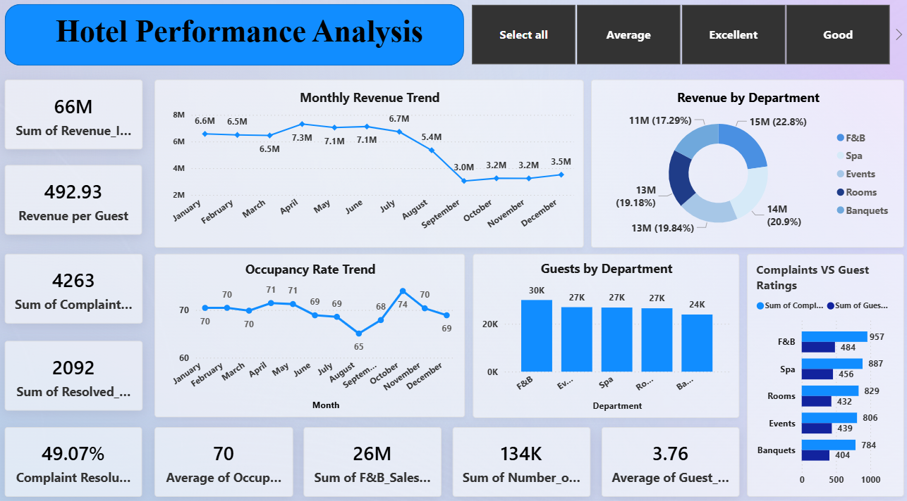

# Hotel Performance Analysis Dashboard (Power BI)

## Project Overview
This project is a Hotel Performance Dashboard built using Power BI.  
It analyzes revenue trends, occupancy rates, departmental performance, guest feedback, and complaint resolution.  
The goal is to identify revenue drivers and operational gaps in hotel management.

---

## Objectives
- Analyze seasonal revenue trends  
- Evaluate departmental contribution  
- Monitor occupancy performance  
- Identify service gaps through complaint analysis  
- Track guest satisfaction levels  

---

## Tools & Technologies
- Power BI  
- Microsoft Excel  
- DAX  
- Data Cleaning & Transformation  

---

## 📊 Dashboard Visualization

### Hotel Performance Dashboard

---

## Key Insights

### 1. Revenue Trend
- Total Revenue: 66M INR  
- Strong performance from January to July  
- Sharp decline after August, lowest around September–October  
- Indicates clear seasonal slowdown in the second half of the year  

---

### 2. Department Revenue Contribution
- F&B is the highest contributor (~15M)  
- Spa and Events perform well  
- Banquets and Rooms contribute moderately  
- F&B is the strongest revenue-driving department  

---

### 3. Occupancy Trend
- Significant drop in occupancy after August  
- Strong correlation between occupancy and revenue decline  
- Slight recovery after September but still below first half performance  

---

### 4. Guest Volume Insight
- Total Guests: 134K  
- F&B has highest footfall (~30K)  
- Banquets has lowest (~24K)  
- Confirms F&B dominance in both revenue and traffic  

---

### 5. Complaints Analysis
- Total Complaints: 4,263  
- Resolved: 2,092  
- Resolution Rate: 49%  
- High complaint rate indicates service gap  
- Highest complaints in F&B (957) and Spa (887)  

---

### 6. Guest Feedback
- Average Rating: 3.76 / 5  
- Moderate satisfaction level  
- Aligns with high complaints and low resolution rate  

---

## Business Recommendations

### 1. Low Season Strategy
- Introduce discounts during September–October  
- Offer combo packages (Room + Spa / F&B deals)  
- Target corporate events and group bookings  

---

### 2. Improve Complaint Resolution
- Implement structured complaint tracking system  
- Improve department-level accountability  
- Target 80%+ resolution rate  

---

### 3. Focus on F&B Growth
- Introduce premium menu options  
- Implement loyalty programs  
- Train staff for upselling opportunities  

---

### 4. Improve Spa & F&B Service Quality
- Conduct regular staff training  
- Monitor weekly guest feedback  
- Fix recurring service issues  

---

### 5. Increase Revenue per Guest
- Introduce add-on services  
- Offer bundled packages  
- Promote upselling at check-in  

---

## Conclusion
This dashboard provides clear insights into hotel performance, helping management make data-driven decisions to improve revenue, guest satisfaction, and operational efficiency.
